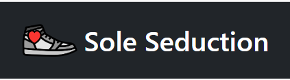
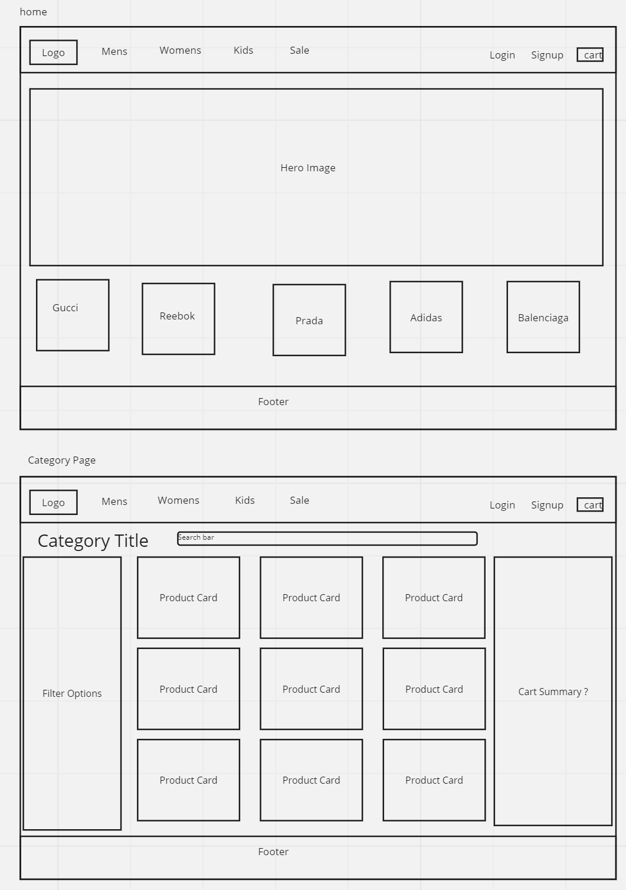
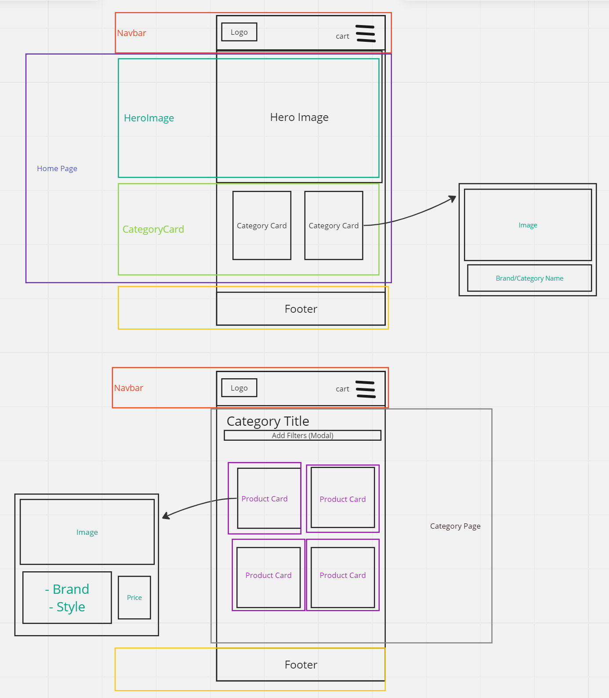
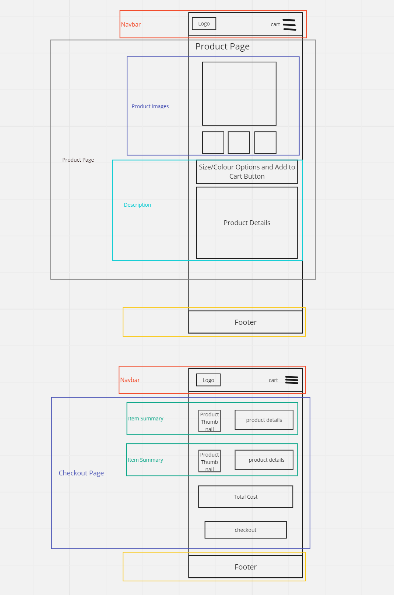
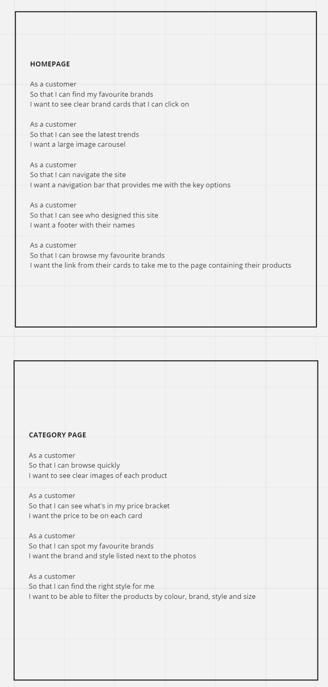
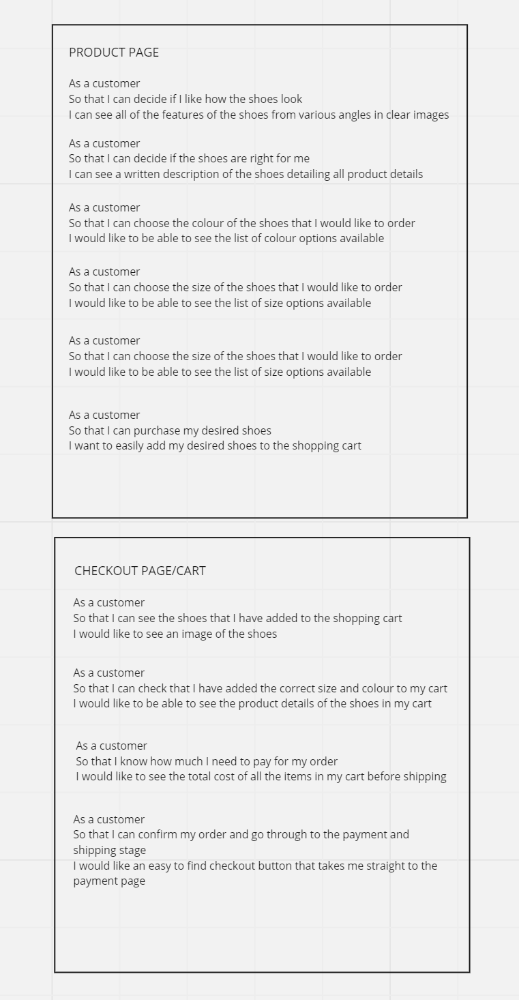
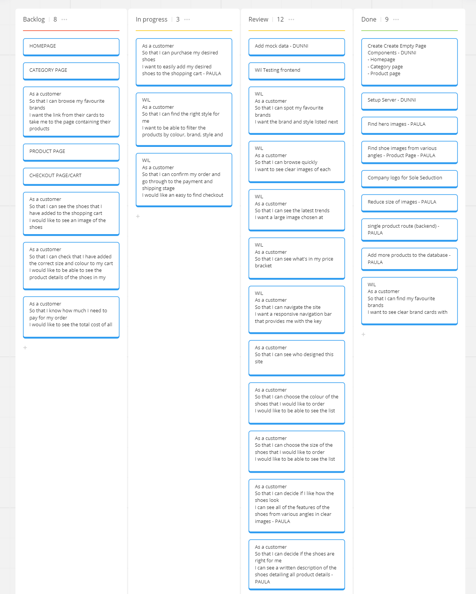

### A group ecommerce project for an online shoe store
.
## TECHNOLOGY STACK
- React
- Express
- NodeJs
- MongoDB 

## INSTRUCTIONS
- `npm i` to install all dependencies
- `npm start` to connect the backend to the server
- `npm run dev` to open the frontend in the browser
## PLANNING
### Wireframes
We designed the UI of the desktop view of the homepage, category page, product page and checkout page (shopping cart):

### Component Hierarchy
We did wireframes for the mobile view of the four pages and then used these to establish the component hierarchy

- Navbar
- Footer
- Home page
  - Hero Image
  - Category card
- Category page
  - Product card
- Product page
  - Product images
  - Product description
- Checkout page
  - Item summary

### User Stories
Our next step, using the original brief and the component hierarchies, was to produce a list of user stories:

### Scrum board
The final part of our planning stage was to add the user stories to the backlog of our scrumboard to organise our workload:

## CONTRIBUTORS
We would like to acknowledge and highlight the coding contributions made by each member of our group:
### Dunni:

### Wil:

### Paula:

## TESTING