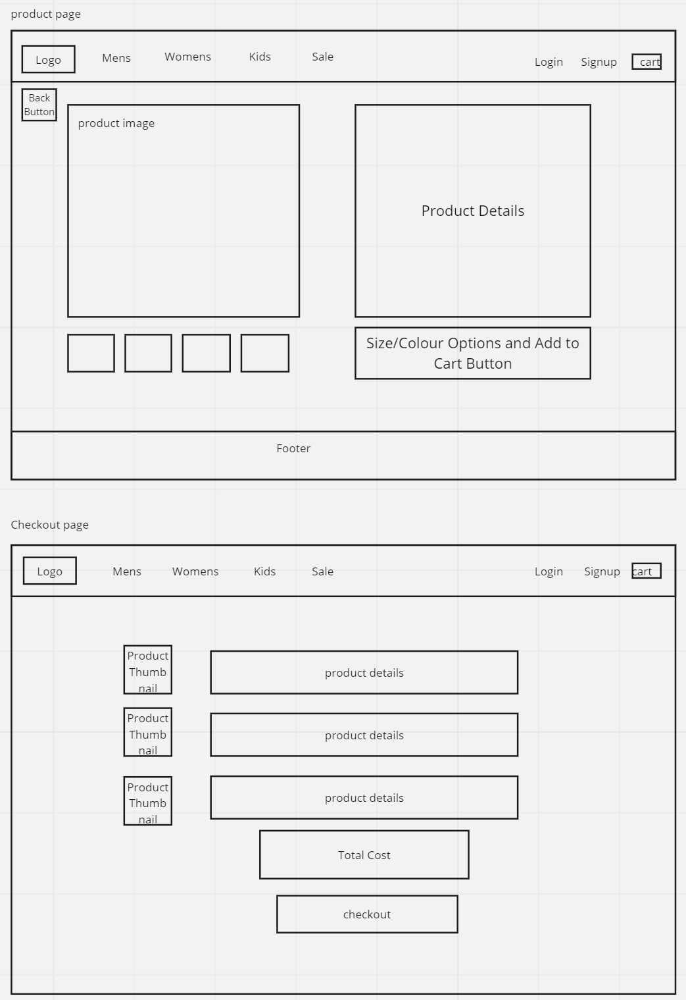

### A group ecommerce project for an online shoe store
.
## TECHNOLOGY STACK
- React
- Express
- NodeJs
- MongoDB 

## INSTRUCTIONS
- `npm i` to install all dependencies
- `npm start` to connect the backend to the server
- `npm run dev` to open the frontend in the browser
## PLANNING
### Wireframes
We designed the UI of the desktop view of the homepage, category page, product page and checkout page (shopping cart):

### Component Hierarchy
We did wireframes for the mobile view of the four pages and then used these to establish the component hierarchy

- Navbar
- Footer
- Home page
  - Hero Image
  - Category card
- Category page
  - Product card
- Product page
  - Product images
  - Product description
- Checkout page
  - Item summary

### User Stories
Our next step, using the original brief and the component hierarchies, was to produce a list of user stories:

### Scrum board
The final part of our planning stage was to add the user stories to the backlog of our scrumboard to organise our workload:

## CONTRIBUTORS
We would like to acknowledge and highlight the coding contributions made by each member of our group:
### Dunni:
- MongoDB setup
- Initial route setup
- Category filtering
- Filter toggling
### Wil:
- Filter Modal
- Front End testing
- Modals for warning messages
- Brand and Category card arrays and product cards
### Paula:

## TESTING
Test files can be found nested with the components on the front end. Components are tested using the React Testing Library. Out API routes were tested manually using Postman.

## Future Work
If you would like to add to this project, feel free to Fork it to your own repository and then make a pull request for new features.
Some ideas for ways to improve it are:
- It currently doesn't allow users to register, and there are no user roles.
- User roles could be used to assign people to customers, or administrators.
- A content management system to add, remove and update products.
- The ability to discount products and add them to a sale category.
